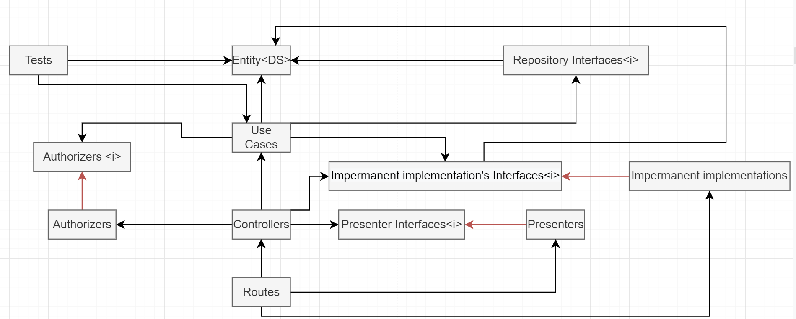
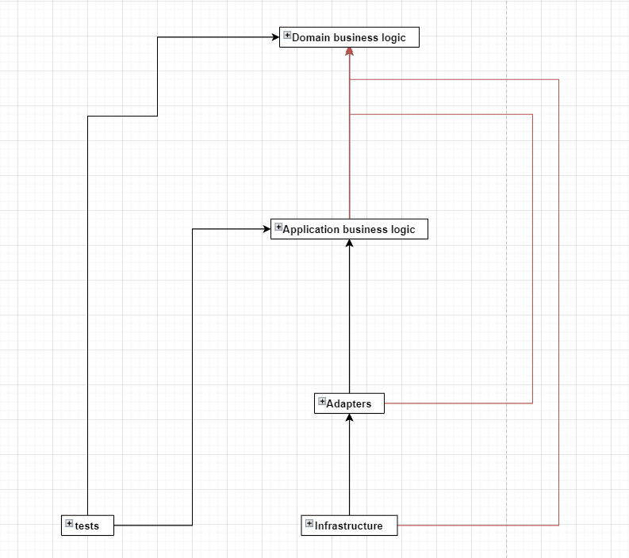

## Simple oauth2 protocol implementation with Node.js and Typescript
### What is it?
This is a simple application, in which I tried to follow principles and rules from the book "Clean Architecture".

### Usage
Start mongodb, change the database url in the config file and then run those commands in a terminal

    npm i
    npm run dev
    
### Clean Architecture

#### Classes, interfaces and functions dependency graph. 
Because the project contains many classes, functions, and interfaces, a graph including all of them is unreadable, so I made simplified and universal graph for each route.

#### Components dependency graph
As you can see, all arrows are pointing up

Black arrow - uses  
Red arrow - implements / extends
